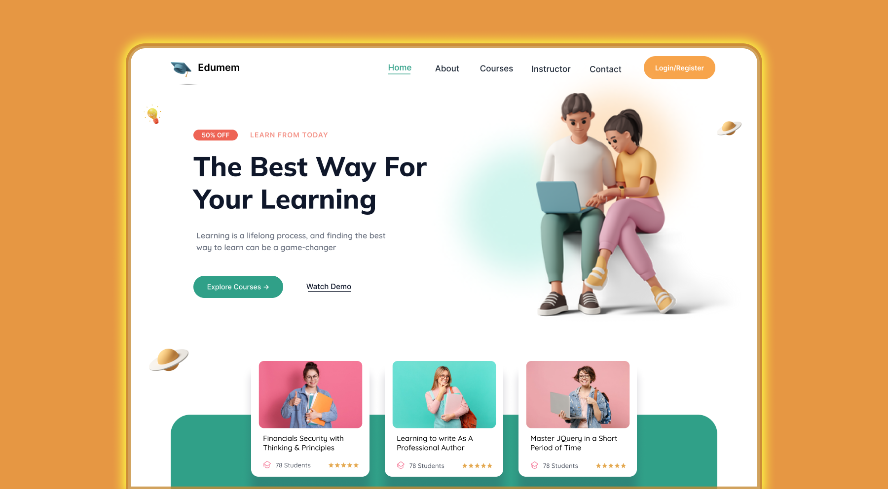

# Responsive Landing Page using HTML, CSS & JavaScript 🚀

A modern **responsive landing page** built using **HTML**, **CSS**, and **Vanilla JavaScript**.  
This project demonstrates core front-end development concepts such as responsive layouts, clean UI design, and basic interactivity.

---

## 🔥 Features

- 📱 Fully **responsive design** (mobile, tablet & desktop)
- 🎨 Clean and modern UI
- ⚡ Lightweight & fast (no frameworks)
- 🧩 Organized project structure
- 🖼️ Includes icons and image assets
- 🧠 Beginner-friendly codebase

---

## 🛠️ Built With

- **HTML5** – structure  
- **CSS3** – styling & responsiveness  
- **JavaScript (ES6)** – basic interactivity  

---

## 📂 Project Structure

```

RESPONSIVE-landing-page-using-html-css-and-javascript/
│
├── assets/        # CSS & JS files
├── icons/         # Icon assets
├── images/        # Image assets
├── index.html     # Main HTML file
├── preview-new.png
└── README.md

```

---

## 🚀 Getting Started

### 1️⃣ Clone the repository
```bash
git clone https://github.com/ananikets18/RESPONSIVE-landing-page-using-html-css-and-javascript.git
````

### 2️⃣ Open the project

Simply open `index.html` in your browser.

---

## 🎥 Video Tutorial

This project is explained step-by-step in a YouTube tutorial:

👉 **[Watch it on YouTube](https://youtu.be/pX9K9g28CRg)**

💙 Subscribe for more content:
[Annicode YouTube Channel](https://www.youtube.com/@Annicode)

---

## 🖼️ Preview



---

## 📌 Use Cases

* Landing page template
* Frontend practice project
* Portfolio showcase
* UI/UX learning reference

---

## ⭐ Support

If you like this project, don’t forget to **star ⭐ the repository** and share it with others!

